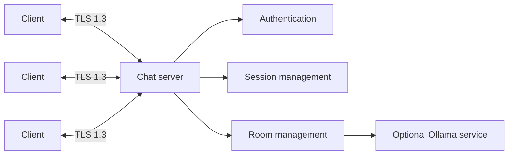

# Secure Distributed Chat

A Java 21 client/server chat system built around secure transport, recoverable sessions, explicit synchronization, and isolation of slow clients.

The server accepts TLS connections using virtual threads, authenticates users with persisted PBKDF2 password records, and keeps each authenticated user in a `ClientSession` that is independent from the underlying socket. This allows a client to reconnect with a short-lived token after an unexpected connection failure.

## Highlights

- TLS 1.3 client/server communication
- Java 21 virtual threads for connection handling
- Registration and login with salted PBKDF2 password hashing
- Secure random session tokens and reconnectable sessions
- Multiple rooms with synchronized membership and message history
- Bounded per-client outbound queues to isolate slow consumers
- Heartbeat-based broken-connection detection
- Optional AI rooms backed by a local Ollama instance
- Scripted checks for reconnect, invalid tokens, heartbeat timeout, concurrency, and slow clients

## Architecture



The central design decision is that a socket is temporary, while the authenticated `ClientSession` is the durable in-memory representation of the user. Room broadcasts enqueue messages into a bounded queue for each session, so a slow client cannot block the room or grow memory without limit.

See [the architecture document](docs/architecture.md) for the full design, concurrency model, protocol flows, synchronization strategy, and failure handling.

## Technology

- Java 21
- Gradle Wrapper
- Java Secure Socket Extension (JSSE)
- TLS 1.3 with locally generated development certificates
- PBKDF2-HMAC-SHA256
- Java virtual threads
- Explicit `ReentrantLock`, `Condition`, and `ReentrantReadWriteLock` synchronization
- Java `HttpClient` for Ollama integration

## Quick start

### Requirements

- Java 21 or newer JDK
- `keytool`, included with the JDK
- Optional: Ollama for AI rooms

Check the local environment:

```bash
java -version
javac -version
keytool -help
```

### Run the server

```bash
./scripts/run-server.sh 12345
```

### Run clients

Open one or more additional terminals:

```bash
./scripts/run-client.sh localhost 12345
```

On Windows:

```bat
scripts\run-server.bat 12345
scripts\run-client.bat localhost 12345
```

The scripts verify Java 21, generate local development TLS material when needed, and run the relevant Gradle task.

## Example session

Client 1:

```text
LOGIN alice alice
JOIN Library
MSG Hello everyone!
```

Client 2:

```text
LOGIN bob bob
JOIN Library
MSG Hi Alice!
```

Room output:

```text
MSG Library System: [alice enters the room]
MSG Library alice: Hello everyone!
MSG Library System: [bob enters the room]
MSG Library bob: Hi Alice!
```

## Protocol commands

Before authentication:

```text
REGISTER <username> <password>
LOGIN <username> <password>
RESUME <token>
HELP
QUIT
```

After authentication:

```text
LIST_ROOMS
JOIN <roomName>
CREATE_AI_ROOM <roomName> | <prompt>
MSG <message>
AI [optional prompt]
LEAVE
HELP
LOGOUT
QUIT
```

| Command | Purpose |
|---|---|
| `REGISTER` | Create a persistent user record. |
| `LOGIN` | Authenticate and receive a session token. |
| `RESUME` | Reconnect with a valid, unexpired token. |
| `LIST_ROOMS` | List available rooms. |
| `JOIN` | Enter a room; unknown normal rooms are created automatically. |
| `CREATE_AI_ROOM` | Create an AI room with a fixed system prompt. |
| `MSG` | Send a message to the active room. |
| `AI` | Ask the bot to respond in an AI room. |
| `LEAVE` | Leave the active room. |
| `LOGOUT` | Invalidate the token and end the session. |
| `QUIT` | Close the connection without intentionally invalidating the token. |

## Local users and persistence

On the first server run, the application creates three development users when `data/users.txt` does not yet exist:

```text
alice / alice
bob / bob
eve / eve
```

New users are appended to `data/users.txt`. Passwords are stored as salted PBKDF2 hashes rather than plaintext. The generated user file is ignored by Git.

> The bundled users are for local demonstration only. Do not use these credentials in a deployed environment.

## TLS configuration

The run scripts generate the following untracked development files:

```text
certs/server-keystore.p12
certs/server-cert.pem
certs/client-truststore.p12
```

The default local certificate password is intentionally a development-only value. Override it before using the project outside a local demonstration:

```bash
export CHAT_TLS_PASSWORD='replace-with-a-local-secret'
./scripts/generate-dev-certs.sh
./scripts/run-server.sh
```

Available configuration:

| Environment variable | Default |
|---|---|
| `CHAT_TLS_PASSWORD` | `local-development-only` |
| `CHAT_SERVER_KEYSTORE_PATH` | `certs/server-keystore.p12` |
| `CHAT_CLIENT_TRUSTSTORE_PATH` | `certs/client-truststore.p12` |

Equivalent Java system properties are `chat.tls.password`, `chat.server.keystore`, and `chat.client.truststore`.

The generated self-signed certificate is valid for `localhost` and `127.0.0.1`; it is not intended for production use.

## AI rooms

AI rooms use a separately running local Ollama service. The normal chat server does not require or start Ollama.

Optional helper:

```bash
./scripts/run-ollama.sh llama3
```

Example:

```text
LOGIN alice alice
CREATE_AI_ROOM Planning | Summarize availability and propose a meeting time
JOIN Planning
MSG I can meet Monday morning
AI
```

## Testing

Run the unit tests:

```bash
./gradlew test
```

Run all verification tasks:

```bash
./gradlew check
```

For end-to-end scenario checks, start the server and execute one of:

```bash
./scripts/run-scenario.sh reconnect localhost 12345
./scripts/run-scenario.sh invalid-token localhost 12345
./scripts/run-scenario.sh heartbeat localhost 12345
./scripts/run-scenario.sh slow-client localhost 12345
./scripts/run-scenario.sh concurrent localhost 12345
```

GitHub Actions builds and tests the project on pushes and pull requests.

## Project structure

```text
.
├── docs/                       Architecture and design documentation
├── scripts/                    Cross-platform setup and run helpers
├── src/main/java/chat/client   CLI client and reconnection logic
├── src/main/java/chat/server   Server, authentication, rooms, sessions, and AI
├── src/test/java               Unit and end-to-end scenario checks
├── build.gradle
└── gradlew / gradlew.bat
```

## Project context and contributions

This project originated as a team university project in distributed systems and was later reorganized for portfolio presentation.

## My Contributions

This project was developed by a three-person team. My main contributions included:

* Designed the initial system architecture and project structure.
* Implemented TLS-secured communication between clients and the server.
* Designed and implemented the socket-based communication layer.
* Developed the virtual-thread-based concurrency architecture.
* Implemented user registration, authentication, session management, and reconnection support.
* Designed thread-safe data storage for users, chat rooms, sessions, and connected clients.
* Contributed to fault-tolerance mechanisms, including handling client disconnections, session recovery, and slow clients.
* Participated in system integration, debugging, and end-to-end testing.

The remaining work was divided between the other team members. One team member contributed to additional fault-tolerance mechanisms, while another implemented the AI-enabled chat rooms and user interface.


**Before publishing, replace this paragraph with your individual contribution**, for example the components you designed, implemented, tested, or integrated. Avoid assigning a percentage; name the concrete engineering work instead.

## Current limitations

- The architecture uses one central server rather than replicated server nodes.
- Users and room history are stored locally rather than in a database.
- Room history is not replayed with sequence numbers after reconnect.
- TLS certificates are generated for local development only.
- AI availability depends on an external Ollama process.

## Publishing note

No licence has been added because this began as a team project. Confirm publication rights with the other contributors and the university before selecting a licence or making the repository public.
