# Architecture and Distributed Systems Design

This document explains the architecture of the Secure Distributed Chat system. It focuses on the distributed-computing aspects: client/server communication, secure sockets, thread architecture, shared-state synchronization, room broadcasting, fault tolerance, session recovery, and slow-client isolation.

## 1. Architectural idea

The project is a distributed chat system with one server process and multiple client processes.

The most important design idea is:

```text
A socket is temporary.
A ClientSession is the real user state.
```

A TCP/TLS connection can break and be replaced. The user state should remain in the server, inside a `ClientSession`, so that a reconnecting client can resume using a token.

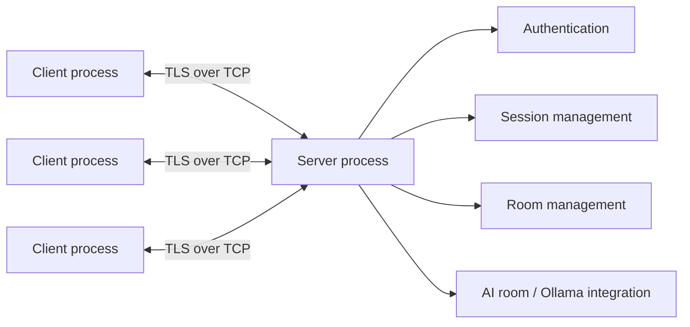
```mermaid
flowchart LR
    C1[Client process] <-->|TLS over TCP| S[Server process]
    C2[Client process] <-->|TLS over TCP| S
    C3[Client process] <-->|TLS over TCP| S

    S --> AUTH[Authentication]
    S --> SESS[Session management]
    S --> ROOMS[Room management]
    S --> AI[AI room / Ollama integration]
```

The protocol is line-based. Each command or response is one text line transported through a TLS socket.

Examples:

```text
LOGIN alice alice
JOIN Library
MSG Hello everyone
RESUME <token>
CREATE_AI_ROOM AI doodle | Summarize availability
```

---

## 2. Main package responsibilities

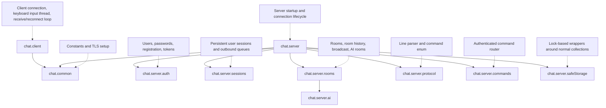
```mermaid
flowchart TB
    CLIENT[chat.client] --> COMMON[chat.common]
    SERVER[chat.server] --> COMMON
    SERVER --> AUTH[chat.server.auth]
    SERVER --> SESS[chat.server.sessions]
    SERVER --> ROOMS[chat.server.rooms]
    SERVER --> PROTO[chat.server.protocol]
    SERVER --> CMDS[chat.server.commands]
    SERVER --> SAFE[chat.server.safeStorage]
    ROOMS --> AI[chat.server.ai]

    CLIENT_LABEL[Client connection, keyboard input thread, receive/reconnect loop] -.-> CLIENT
    COMMON_LABEL[Constants and TLS setup] -.-> COMMON
    SERVER_LABEL[Server startup and connection lifecycle] -.-> SERVER
    AUTH_LABEL[Users, passwords, registration, tokens] -.-> AUTH
    SESS_LABEL[Persistent user sessions and outbound queues] -.-> SESS
    ROOMS_LABEL[Rooms, room history, broadcast, AI rooms] -.-> ROOMS
    PROTO_LABEL[Line parser and command enum] -.-> PROTO
    CMDS_LABEL[Authenticated command router] -.-> CMDS
    SAFE_LABEL[Lock-based wrappers around normal collections] -.-> SAFE
```

Operational note: Ollama is treated as an external local service. The normal server script does not start Docker or require sudo. If AI rooms are needed, `./scripts/run-ollama.sh llama3` can be run separately to start `ollama serve` and pull the model if missing.

### Main packages

| Package | Purpose |
|---|---|
| `chat.client` | Client program, TLS client connection, keyboard input, server receiver loop, reconnect helper. |
| `chat.common` | Shared constants such as default port, queue size, TLS version, cipher suites, keystore paths. |
| `chat.common.security` | TLS setup through `TlsConfig`. |
| `chat.server` | Server startup, accepted connection handling, and central server service container. |
| `chat.server.auth` | Login, registration, user persistence, password hashing, token generation. |
| `chat.server.sessions` | Persistent user sessions, reconnect state, outbound queues. |
| `chat.server.rooms` | Room management, broadcast, message history, normal rooms, AI rooms. |
| `chat.server.ai` | Local LLM/Ollama integration wrapper using Java SE HttpClient. |
| `chat.server.protocol` | Command parser, command enum, protocol objects. |
| `chat.server.commands` | Authenticated command routing. |
| `chat.server.safeStorage` | Lock-based wrappers for normal Java collections. |

---

## 3. Main class relationship diagram

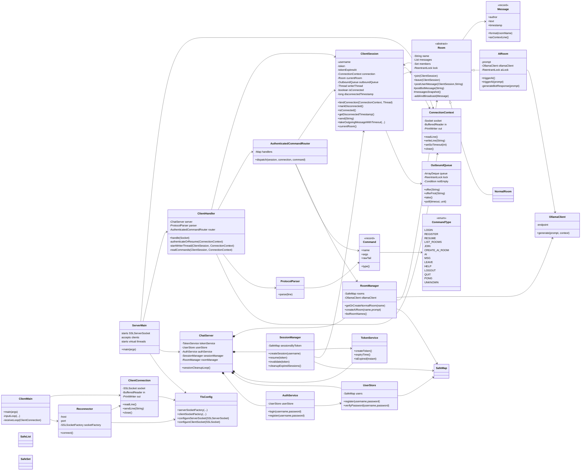
```mermaid
classDiagram
    direction LR

    class ServerMain {
        +main(args)
        starts SSLServerSocket
        accepts clients
        starts virtual threads
    }

    class ChatServer {
        -TokenService tokenService
        -UserStore userStore
        -AuthService authService
        -SessionManager sessionManager
        -RoomManager roomManager
        +sessionCleanupLoop()
    }

    class ClientHandler {
        -ChatServer server
        -ProtocolParser parser
        -AuthenticatedCommandRouter router
        +handle(Socket)
        -authenticateOrResume(ConnectionContext)
        -startWriterThread(ClientSession, ConnectionContext)
        -readCommands(ClientSession, ConnectionContext)
    }

    class ConnectionContext {
        -Socket socket
        -BufferedReader in
        -PrintWriter out
        +readLine()
        +writeLine(String)
        +setSoTimeout(int)
        +close()
    }

    class TlsConfig {
        +serverSocketFactory(...)
        +clientSocketFactory(...)
        +configureServerSocket(SSLServerSocket)
        +configureClientSocket(SSLSocket)
    }

    class ClientMain {
        +main(args)
        -inputLoop(...)
        -receiveLoop(ClientConnection)
    }

    class Reconnector {
        -host
        -port
        -SSLSocketFactory socketFactory
        +connect()
    }

    class ClientConnection {
        -SSLSocket socket
        -BufferedReader in
        -PrintWriter out
        +readLine()
        +sendLine(String)
        +close()
    }

    class AuthService {
        -UserStore userStore
        +login(username,password)
        +register(username,password)
    }

    class UserStore {
        -SafeMap users
        +register(username,password)
        +verifyPassword(username,password)
    }

    class TokenService {
        +createToken()
        +expiryTime()
        +isExpired(Instant)
    }

    class SessionManager {
        -SafeMap sessionsByToken
        +createSession(username)
        +resume(token)
        +invalidate(token)
        +cleanupExpiredSessions()
    }

    class ClientSession {
        -username
        -token
        -tokenExpiresAt
        -ConnectionContext connection
        -Room currentRoom
        -OutboundQueue outboundQueue
        -Thread writerThread
        -boolean isConnected
        -long disconnectedTimestamp
        +bindConnection(ConnectionContext, Thread)
        +markDisconnected()
        +isConnected()
        +getDisconnectedTimestamp()
        +send(String)
        +takeOutgoingMessageWithTimeout(...)
        +currentRoom()
    }

    class OutboundQueue {
        -ArrayDeque queue
        -ReentrantLock lock
        -Condition notEmpty
        +offer(String)
        +offerFirst(String)
        +take()
        +poll(timeout, unit)
    }

    class RoomManager {
        -SafeMap rooms
        -OllamaClient ollamaClient
        +getOrCreateNormalRoom(name)
        +createAIRoom(name,prompt)
        +listRoomNames()
    }

    class Room {
        <<abstract>>
        -String name
        -List messages
        -Set members
        -ReentrantLock lock
        +join(ClientSession)
        +leave(ClientSession)
        +postUserMessage(ClientSession,String)
        #postBotMessage(String)
        #messagesSnapshot()
        -addAndBroadcast(Message)
    }

    class NormalRoom
    class AIRoom {
        -prompt
        -OllamaClient ollamaClient
        -ReentrantLock aiLock
        +triggerAI()
        +triggerAI(prompt)
        -generateBotResponse(prompt)
    }

    class Message {
        <<record>>
        +author
        +text
        +timestamp
        +format(roomName)
        +asContextLine()
    }

    class OllamaClient {
        -endpoint
        +generate(prompt, context)
    }

    class ProtocolParser {
        +parse(line)
    }

    class Command {
        <<record>>
        +name
        +args
        +rawTail
        +type()
    }

    class CommandType {
        <<enum>>
        LOGIN
        REGISTER
        RESUME
        LIST_ROOMS
        JOIN
        CREATE_AI_ROOM
        AI
        MSG
        LEAVE
        HELP
        LOGOUT
        QUIT
        PONG
        UNKNOWN
    }

    class AuthenticatedCommandRouter {
        -Map handlers
        +dispatch(session, connection, command)
    }

    class SafeMap
    class SafeList
    class SafeSet

    ServerMain --> TlsConfig
    ServerMain --> ChatServer
    ServerMain --> ClientHandler
    ServerMain --> ConnectionContext

    ChatServer *-- AuthService
    ChatServer *-- UserStore
    ChatServer *-- TokenService
    ChatServer *-- SessionManager
    ChatServer *-- RoomManager

    ClientHandler --> ConnectionContext
    ClientHandler --> ProtocolParser
    ClientHandler --> AuthenticatedCommandRouter
    ClientHandler --> ClientSession

    AuthService --> UserStore
    UserStore --> SafeMap
    SessionManager --> SafeMap
    SessionManager --> ClientSession
    SessionManager --> TokenService
    ClientSession --> OutboundQueue
    ClientSession --> Room
    ClientSession --> ConnectionContext

    RoomManager --> SafeMap
    RoomManager --> Room
    RoomManager --> OllamaClient
    Room <|-- NormalRoom
    Room <|-- AIRoom
    Room --> Message
    Room --> ClientSession
    AIRoom --> OllamaClient

    ProtocolParser --> Command
    Command --> CommandType
    AuthenticatedCommandRouter --> Command
    AuthenticatedCommandRouter --> RoomManager
    AuthenticatedCommandRouter --> ClientSession

    ClientMain --> Reconnector
    ClientMain --> ClientConnection
    Reconnector --> TlsConfig
    Reconnector --> ClientConnection
    ClientConnection --> TlsConfig
```

---

## 4. Class purpose table

| Class | Role | Wrapper? | Main responsibility |
|---|---:|---:|---|
| `ServerMain` | Server entry point | No | Opens the TLS server socket and starts a virtual thread per accepted client. |
| `ChatServer` | Service container | No | Owns shared server services and starts the virtual cleanup loop for expired disconnected sessions. |
| `ClientHandler` | Per-connection server controller | No | Handles one client connection: authenticate/resume, start writer thread, read commands. |
| `ConnectionContext` | Socket I/O abstraction | Yes | Wraps a server-side socket with line-based `readLine` and `writeLine`. |
| `ClientMain` | Client entry point | No | Starts the client, keyboard input thread, receiver loop, reconnect loop. |
| `ClientConnection` | Client socket wrapper | Yes | Wraps `SSLSocket` with line-based reading/writing. |
| `Reconnector` | Client connection factory | Yes-ish | Holds host/port/TLS factory and creates new `ClientConnection` objects. |
| `TlsConfig` | TLS factory/config helper | Yes-ish | Loads keystore/truststore and configures TLS protocol, cipher suites, hostname verification. |
| `Constants` | Configuration | No | Stores default port, token TTL, heartbeat timing, TLS config, keystore paths. |
| `AuthService` | Auth logic | No | Login/register service using `UserStore`. |
| `UserStore` | User repository | No | Loads, stores, registers, verifies users with PBKDF2 hashes. |
| `UserRecord` | Data record | No | One persisted user: username, iterations, salt, hash. |
| `AuthResult` | Data record | No | Success/failure result for auth operations. |
| `TokenService` | Token service | No | Creates random tokens and checks expiry. |
| `SessionManager` | Session repository | No | Maps tokens to `ClientSession`, resumes, invalidates, and cleans expired disconnected sessions. |
| `ClientSession` | User-state object | No | Stores identity, token, current room, connection, writer thread, outbound queue, and disconnected/recoverable state. |
| `OutboundQueue` | Queue wrapper | Yes | Lock-based queue used by writer threads. |
| `RoomManager` | Room repository/factory | No | Stores all rooms and creates normal/AI rooms. |
| `Room` | Base room | No | Owns members, history, joining/leaving, message broadcast. |
| `NormalRoom` | Simple room | No | Normal chat room; inherits base room behavior. |
| `AIRoom` | AI room | No | Starts AI virtual thread when the authenticated `AI` command requests a Bot response. |
| `Message` | Data record | No | Represents room message and formats protocol output. |
| `OllamaClient` | External AI wrapper | Yes | Encapsulates the local Ollama HTTP call using Java SE `HttpClient`. |
| `ProtocolParser` | Parser | No | Converts raw line into `Command`. |
| `Command` | Data record | No | Parsed command name, args, and raw tail. |
| `CommandType` | Enum | No | Known protocol commands. |
| `AuthenticatedCommandRouter` | Command dispatcher | No | Maps authenticated commands to behavior. |
| `SafeMap` | Lock-based map wrapper | Yes | Protects `HashMap` using `ReentrantReadWriteLock`. |
| `SafeList` | Lock-based list wrapper | Yes | Protects `ArrayList` using `ReentrantLock`. |
| `SafeSet` | Lock-based set wrapper | Yes | Protects `HashSet` using `ReentrantLock`. |

---

## 5. Server thread architecture

The server uses Java virtual threads to keep blocking I/O simple without creating expensive platform threads for every client.

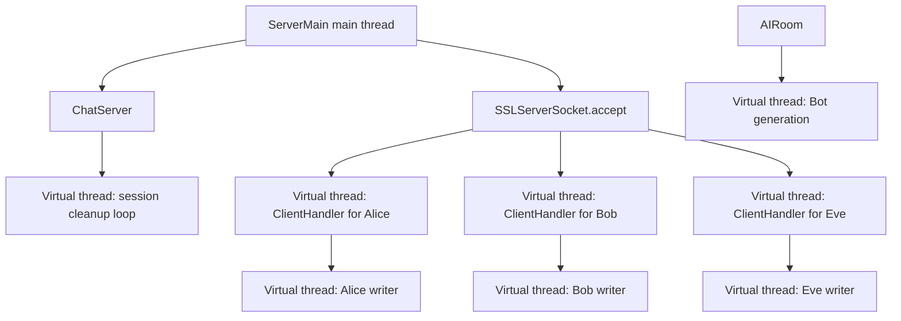
```mermaid
flowchart TB
    MAIN[ServerMain main thread]
    ACCEPT[SSLServerSocket.accept]
    CHAT[ChatServer]
    CLEAN[Virtual thread: session cleanup loop]

    MAIN --> CHAT
    MAIN --> ACCEPT
    CHAT --> CLEAN

    ACCEPT --> A[Virtual thread: ClientHandler for Alice]
    ACCEPT --> B[Virtual thread: ClientHandler for Bob]
    ACCEPT --> C[Virtual thread: ClientHandler for Eve]

    A --> AW[Virtual thread: Alice writer]
    B --> BW[Virtual thread: Bob writer]
    C --> CW[Virtual thread: Eve writer]

    AIROOM[AIRoom]
    AIROOM --> AI1[Virtual thread: Bot generation]
```

### Server threads

| Thread | Created by | Runs code in | Responsibility |
|---|---|---|---|
| Server main thread | JVM | `ServerMain.main` | Create `SSLServerSocket`, accept clients, start client handler virtual threads. |
| Client reader/control virtual thread | `ServerMain` | `ClientHandler.handle` | Handle one socket, authenticate/resume, read commands, dispatch commands. |
| Client writer virtual thread | `ClientHandler.startWriterThread` | Writer loop using `ClientSession` queue | Send queued messages to one client. Also sends heartbeat `PING` when idle. |
| AI response virtual thread | `AuthenticatedCommandRouter.triggerAi` / `AIRoom.triggerAI` | `AIRoom.generateBotResponse` | Generate Bot response and post it back into the room. |
| Session cleanup virtual thread | `ChatServer` constructor | `ChatServer.sessionCleanupLoop` | Sleeps periodically and calls `SessionManager.cleanupExpiredSessions`. |

For two clients, the server normally has:

```text
Server main thread
ChatServer cleanup virtual thread
Alice reader virtual thread
Alice writer virtual thread
Bob reader virtual thread
Bob writer virtual thread
```

The cleanup thread is started by the `ChatServer` constructor. It is not part of any client connection. Every 30 seconds it calls `sessionManager.cleanupExpiredSessions()` so disconnected sessions do not remain in memory forever after their token expires.

The reader and writer for a client share the same socket, but in opposite directions:

```text
server reader thread -> socket input stream
server writer thread -> socket output stream
```

This is safe because TCP/TLS sockets are full-duplex.

---

## 6. Client thread architecture

Each client process has its own threads.

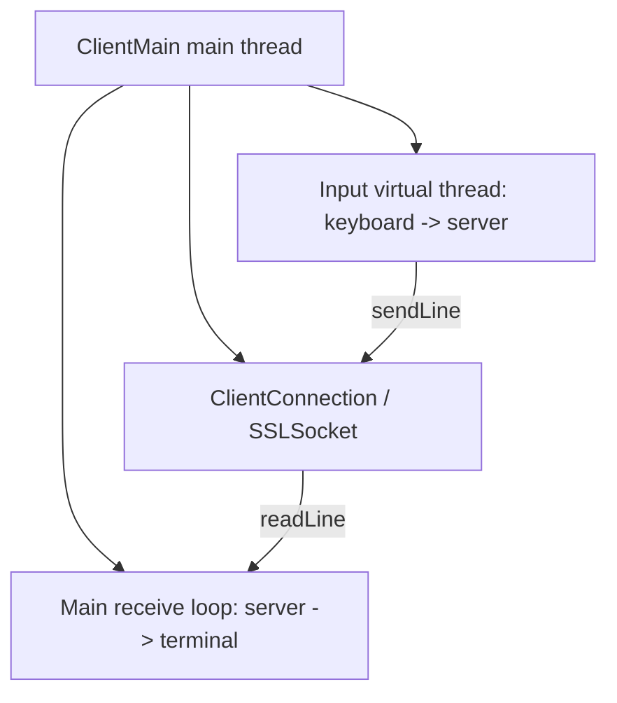
```mermaid
flowchart TB
    CM[ClientMain main thread]
    INPUT[Input virtual thread: keyboard -> server]
    RECV[Main receive loop: server -> terminal]
    CONN[ClientConnection / SSLSocket]

    CM --> CONN
    CM --> INPUT
    CM --> RECV
    INPUT -->|sendLine| CONN
    CONN -->|readLine| RECV
```

In the current code, `ClientMain` starts an input virtual thread to read the keyboard, while the main loop creates connections and runs the receive loop. The receive loop reads server messages, prints them, stores tokens, handles `PING` with `PONG`, and triggers reconnect behavior when the connection closes.

### Client responsibilities

| Thread | Responsibility |
|---|---|
| Client main/reconnect loop | Creates TLS connections, sends `RESUME` when token exists, runs `receiveLoop`, retries if server is unavailable. |
| Client input virtual thread | Reads keyboard input and sends lines through the current `ClientConnection`. |

---

## 7. Authentication flow

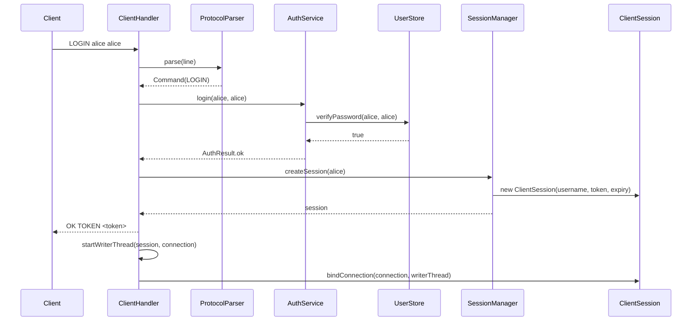
```mermaid
sequenceDiagram
    participant Client
    participant Handler as ClientHandler
    participant Parser as ProtocolParser
    participant Auth as AuthService
    participant Users as UserStore
    participant Sessions as SessionManager
    participant Session as ClientSession

    Client->>Handler: LOGIN alice alice
    Handler->>Parser: parse(line)
    Parser-->>Handler: Command(LOGIN)
    Handler->>Auth: login(alice, alice)
    Auth->>Users: verifyPassword(alice, alice)
    Users-->>Auth: true
    Auth-->>Handler: AuthResult.ok
    Handler->>Sessions: createSession(alice)
    Sessions->>Session: new ClientSession(username, token, expiry)
    Sessions-->>Handler: session
    Handler-->>Client: OK TOKEN <token>
    Handler->>Handler: startWriterThread(session, connection)
    Handler->>Session: bindConnection(connection, writerThread)
```

After login, the server sends a token. The client stores it and can later use it for reconnect with `RESUME <token>`.

---

## 8. Resume / reconnect flow

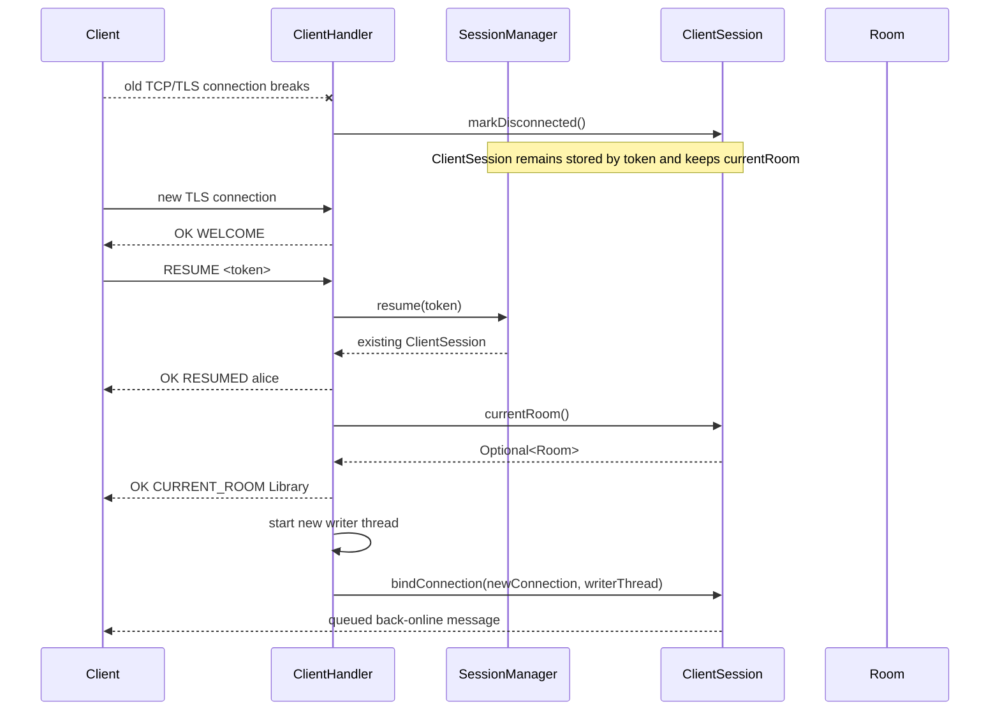
```mermaid
sequenceDiagram
    participant Client
    participant Handler as ClientHandler
    participant Sessions as SessionManager
    participant Session as ClientSession
    participant Room

    Client--xHandler: old TCP/TLS connection breaks
    Handler->>Session: markDisconnected()
    Note over Sessions,Session: ClientSession remains stored by token and keeps currentRoom

    Client->>Handler: new TLS connection
    Handler-->>Client: OK WELCOME
    Client->>Handler: RESUME <token>
    Handler->>Sessions: resume(token)
    Sessions-->>Handler: existing ClientSession
    Handler-->>Client: OK RESUMED alice
    Handler->>Session: currentRoom()
    Session-->>Handler: Optional<Room>
    Handler-->>Client: OK CURRENT_ROOM Library
    Handler->>Handler: start new writer thread
    Handler->>Session: bindConnection(newConnection, writerThread)
    Session-->>Client: queued back-online message
```

The key point is that `SessionManager` maps tokens to sessions:

```text
token -> ClientSession
```

The session stores the current room, so the user can resume in the same room. On an unexpected socket break, `ClientHandler` reaches its `finally` block and calls `session.markDisconnected()` as long as the token is still valid. That sets `isConnected=false`, stores `disconnectedTimestamp`, and keeps the session recoverable. On resume, `ClientSession.bindConnection(...)` closes/interruption-protects the old connection/writer, stores the new connection/writer, marks the session connected again, resets the disconnected timestamp, and queues a back-online message.

---

## 9. Command handling flow

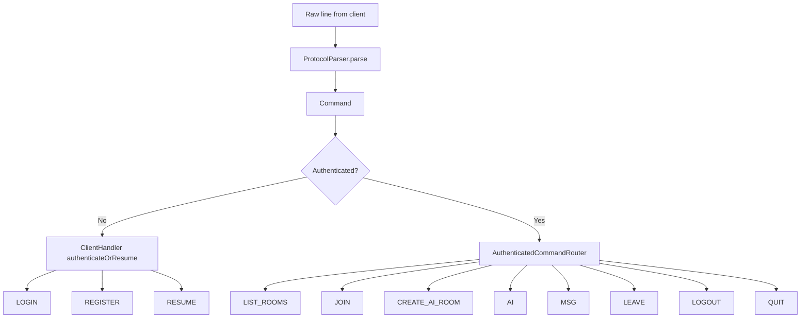
```mermaid
flowchart TD
    LINE[Raw line from client] --> PARSE[ProtocolParser.parse]
    PARSE --> CMD[Command]
    CMD --> AUTHCHECK{Authenticated?}

    AUTHCHECK -->|No| PREAUTH[ClientHandler authenticateOrResume]
    PREAUTH --> LOGIN[LOGIN]
    PREAUTH --> REGISTER[REGISTER]
    PREAUTH --> RESUME[RESUME]

    AUTHCHECK -->|Yes| ROUTER[AuthenticatedCommandRouter]
    ROUTER --> LIST[LIST_ROOMS]
    ROUTER --> JOIN[JOIN]
    ROUTER --> CREATEAI[CREATE_AI_ROOM]
    ROUTER --> MANUALAI[AI]
    ROUTER --> MSG[MSG]
    ROUTER --> LEAVE[LEAVE]
    ROUTER --> LOGOUT[LOGOUT]
    ROUTER --> QUIT[QUIT]
```

`ClientHandler` owns the connection lifecycle. `AuthenticatedCommandRouter` owns the meaning of authenticated commands. This keeps the socket code separate from room/chat behavior.

---

## 10. Room join flow

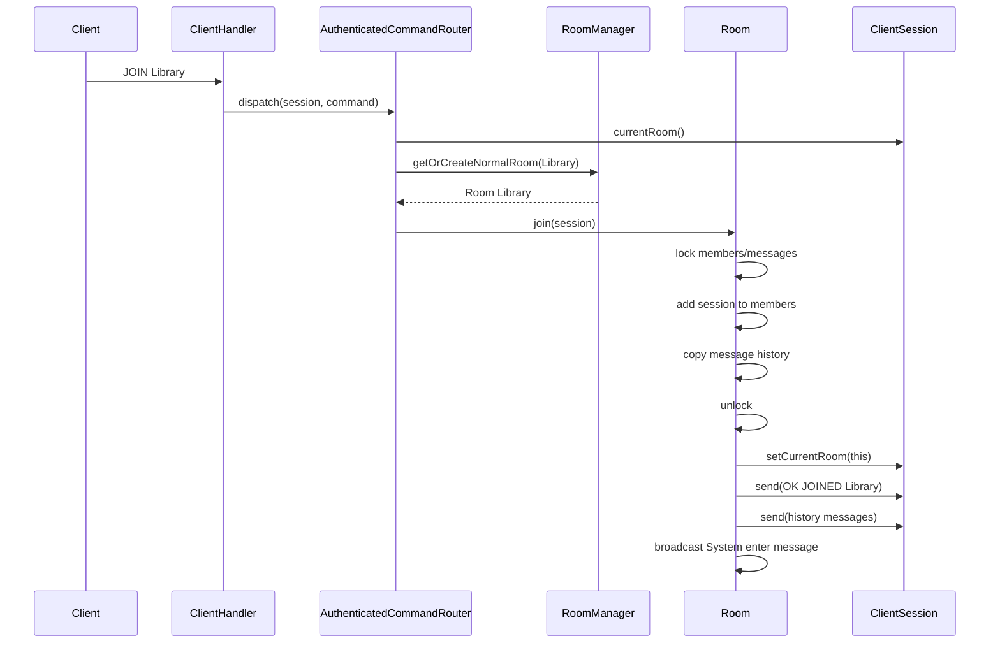
```mermaid
sequenceDiagram
    participant Client
    participant Handler as ClientHandler
    participant Router as AuthenticatedCommandRouter
    participant Rooms as RoomManager
    participant Room
    participant Session as ClientSession

    Client->>Handler: JOIN Library
    Handler->>Router: dispatch(session, command)
    Router->>Session: currentRoom()
    Router->>Rooms: getOrCreateNormalRoom(Library)
    Rooms-->>Router: Room Library
    Router->>Room: join(session)
    Room->>Room: lock members/messages
    Room->>Room: add session to members
    Room->>Room: copy message history
    Room->>Room: unlock
    Room->>Session: setCurrentRoom(this)
    Room->>Session: send(OK JOINED Library)
    Room->>Session: send(history messages)
    Room->>Room: broadcast System enter message
```

---

## 11. Broadcast architecture

Broadcasting is central to the project. A room does not write directly to sockets. It enqueues a formatted message into each recipient session.

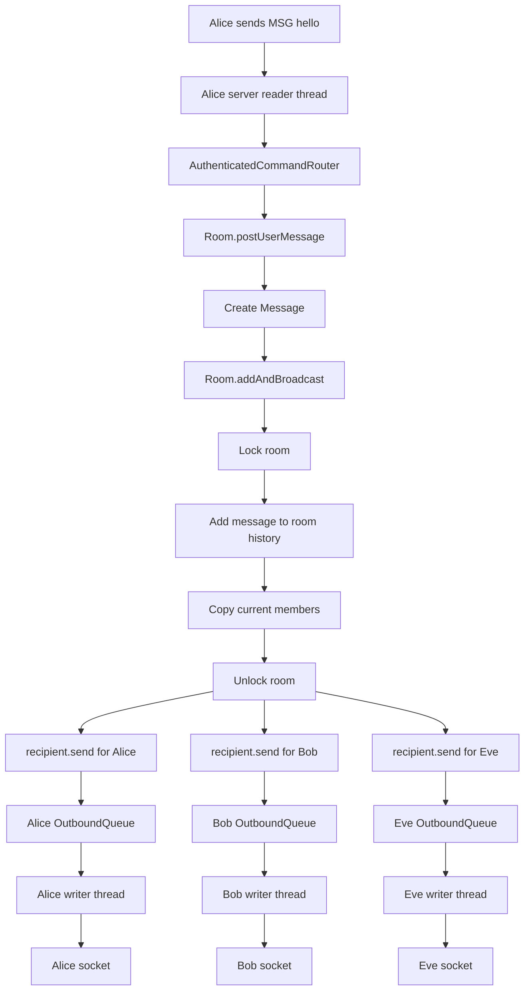
```mermaid
flowchart TD
    A[Alice sends MSG hello] --> B[Alice server reader thread]
    B --> C[AuthenticatedCommandRouter]
    C --> D[Room.postUserMessage]
    D --> E[Create Message]
    E --> F[Room.addAndBroadcast]

    F --> G[Lock room]
    G --> H[Add message to room history]
    H --> I[Copy current members]
    I --> J[Unlock room]

    J --> K[recipient.send for Alice]
    J --> L[recipient.send for Bob]
    J --> M[recipient.send for Eve]

    K --> QA[Alice OutboundQueue]
    L --> QB[Bob OutboundQueue]
    M --> QE[Eve OutboundQueue]

    QA --> WA[Alice writer thread]
    QB --> WB[Bob writer thread]
    QE --> WE[Eve writer thread]

    WA --> SA[Alice socket]
    WB --> SB[Bob socket]
    WE --> SE[Eve socket]
```

The design has two important phases:

```text
1. Under Room lock:
   - add the message to history
   - copy the current members

2. Outside Room lock:
   - enqueue the message into each ClientSession
```

This avoids holding the room lock while writing to sockets. A slow client only affects its own writer thread and queue.

---

## 12. Slow-client isolation

Each `ClientSession` owns an `OutboundQueue`.

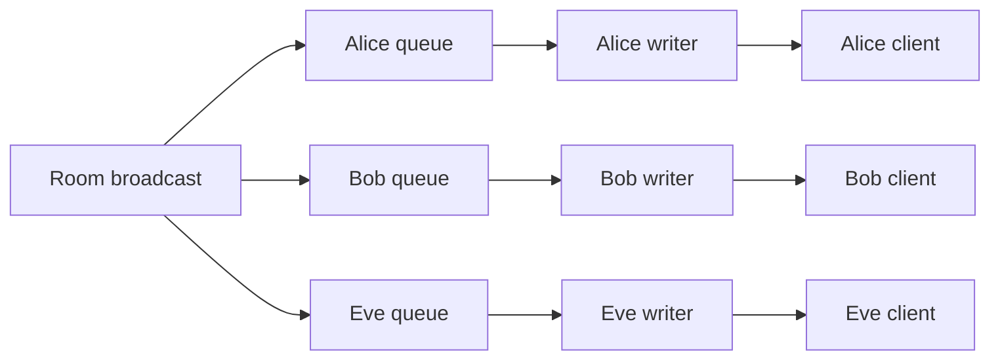
```mermaid
flowchart LR
    ROOM[Room broadcast] --> Q1[Alice queue]
    ROOM --> Q2[Bob queue]
    ROOM --> Q3[Eve queue]

    Q1 --> W1[Alice writer]
    Q2 --> W2[Bob writer]
    Q3 --> W3[Eve writer]

    W1 --> C1[Alice client]
    W2 --> C2[Bob client]
    W3 --> C3[Eve client]
```

If Bob is slow, Bob's writer thread may block or his queue may grow. The room can still continue broadcasting to Alice and Eve.

The queue has a maximum capacity. If it is full, the oldest message is dropped before adding the newest one. This is a deliberate availability trade-off: it prevents a slow or broken client from exhausting server memory.

---

## 13. AI-room flow

`AIRoom` extends `Room`. In the current project version, normal user messages in an AI room are broadcast and stored like any other room message. The Bot response is requested manually with the authenticated `AI` command while the user is inside an AI room. This lets the room accumulate context first, then ask the Bot when the users want a summary/help response.

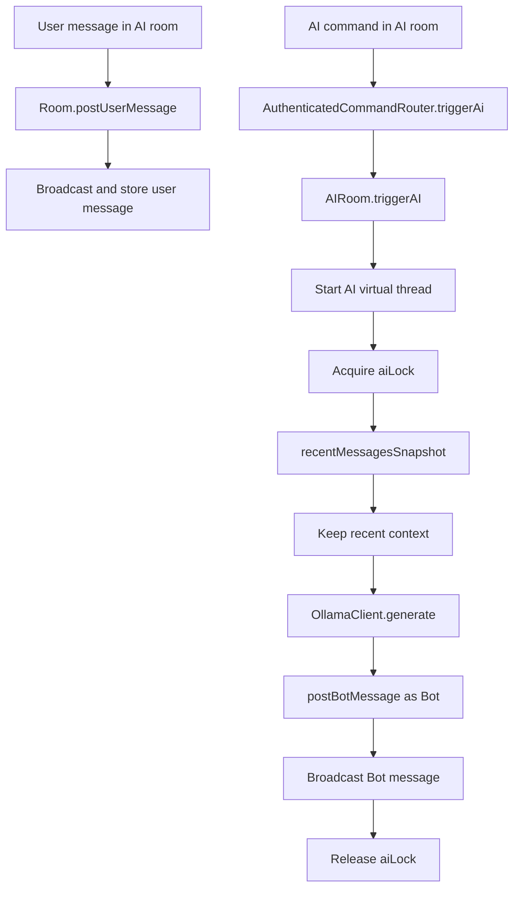
```mermaid
flowchart TD
    U["User message in AI room"]
    POST["Room.postUserMessage"]
    BCAST["Broadcast and store user message"]
    AI_CMD["AI command in AI room"]
    ROUTER["AuthenticatedCommandRouter.triggerAi"]
    TRIGGER["AIRoom.triggerAI"]
    VT["Start AI virtual thread"]
    LOCK["Acquire aiLock"]
    SNAP["recentMessagesSnapshot"]
    LIMIT["Keep recent context"]
    CALL["OllamaClient.generate"]
    BOT["postBotMessage as Bot"]
    BBCAST["Broadcast Bot message"]
    UNLOCK["Release aiLock"]

    U --> POST
    POST --> BCAST
    AI_CMD --> ROUTER
    ROUTER --> TRIGGER
    TRIGGER --> VT
    VT --> LOCK
    LOCK --> SNAP
    SNAP --> LIMIT
    LIMIT --> CALL
    CALL --> BOT
    BOT --> BBCAST
    BBCAST --> UNLOCK
```

The `aiLock` ensures that only one AI generation runs at a time per AI room. Without this, several users could request AI responses close together and create overlapping Ollama calls with confusing response order.

Bot messages are not special at delivery time. They use the same `Room.addAndBroadcast` path as user messages. If Ollama is unavailable, the AI room posts a controlled Bot/error message instead of crashing the server.

---


## 14. TLS and security architecture

The project uses Java secure sockets:

```text
Server: SSLServerSocket
Client: SSLSocket
```

TLS configuration is centralized in `TlsConfig` and `Constants`.

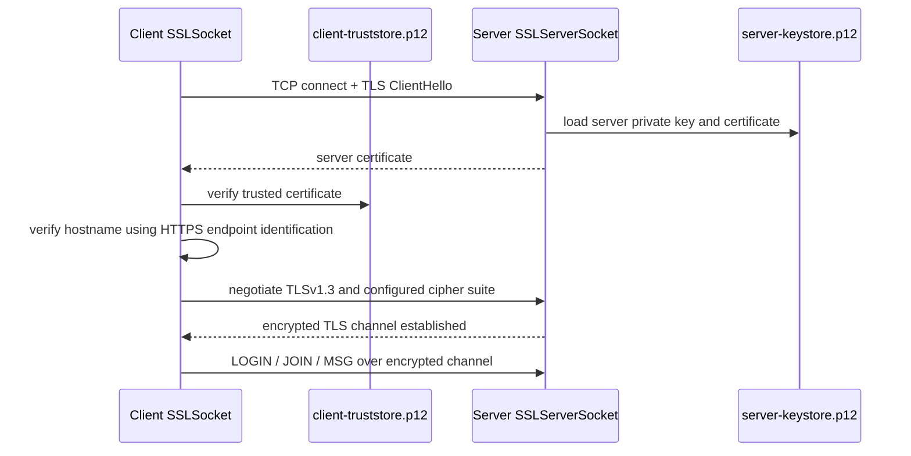
```mermaid
sequenceDiagram
    participant Client as Client SSLSocket
    participant Truststore as client-truststore.p12
    participant Server as Server SSLServerSocket
    participant Keystore as server-keystore.p12

    Client->>Server: TCP connect + TLS ClientHello
    Server->>Keystore: load server private key and certificate
    Server-->>Client: server certificate
    Client->>Truststore: verify trusted certificate
    Client->>Client: verify hostname using HTTPS endpoint identification
    Client->>Server: negotiate TLSv1.3 and configured cipher suite
    Server-->>Client: encrypted TLS channel established
    Client->>Server: LOGIN / JOIN / MSG over encrypted channel
```

### TLS properties

| Item | Implementation |
|---|---|
| Secure server socket | `SSLServerSocket` in `ServerMain` |
| Secure client socket | `SSLSocket` in `ClientConnection` |
| TLS config | `TlsConfig` |
| TLS protocol | `TLSv1.3` |
| Cipher suites | `TLS_AES_128_GCM_SHA256`, `TLS_AES_256_GCM_SHA384` |
| Server identity | `server-keystore.p12` |
| Client trust | `client-truststore.p12` |
| Hostname verification | Enabled in `TlsConfig.configureClientSocket` |
| Mutual TLS | Not used; users authenticate with protocol commands |

The system uses two layers of security:

```text
Transport layer:
    TLS encrypts communication and authenticates the server.

Application layer:
    LOGIN, REGISTER, RESUME, tokens, and password storage handle user identity.
```

---

## 15. Certificate generation

The scripts call `keytool` to generate development TLS material.

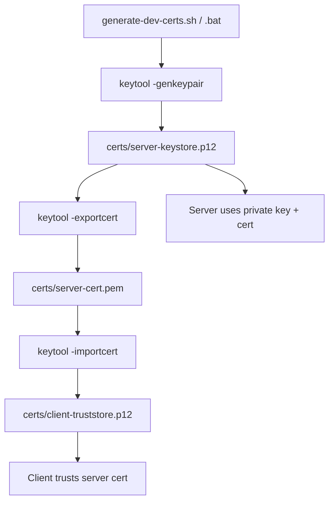
```mermaid
flowchart TD
    SCRIPT[generate-dev-certs.sh / .bat]
    SCRIPT --> KEYPAIR[keytool -genkeypair]
    KEYPAIR --> KEYSTORE[certs/server-keystore.p12]
    KEYSTORE --> EXPORT[keytool -exportcert]
    EXPORT --> PEM[certs/server-cert.pem]
    PEM --> IMPORT[keytool -importcert]
    IMPORT --> TRUSTSTORE[certs/client-truststore.p12]

    KEYSTORE --> SERVER[Server uses private key + cert]
    TRUSTSTORE --> CLIENT[Client trusts server cert]
```

The run scripts generate these files automatically if missing.

---

## 16. Shared state and synchronization

To make synchronization behavior explicit, the implementation uses ordinary collections protected by locks rather than concurrent collection implementations such as `ConcurrentHashMap`, `BlockingQueue`, or `CopyOnWriteArrayList`.

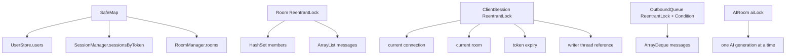
```mermaid
flowchart TB
    SM[SafeMap]
    SM --> U[UserStore.users]
    SM --> S[SessionManager.sessionsByToken]
    SM --> R[RoomManager.rooms]

    ROOM[Room ReentrantLock]
    ROOM --> MEMBERS[HashSet members]
    ROOM --> MSGS[ArrayList messages]

    SESSION[ClientSession ReentrantLock]
    SESSION --> CONN[current connection]
    SESSION --> CURROOM[current room]
    SESSION --> TOKEN[token expiry]
    SESSION --> WRITER[writer thread reference]

    QUEUE[OutboundQueue ReentrantLock + Condition]
    QUEUE --> AQ[ArrayDeque messages]

    AI[AIRoom aiLock]
    AI --> OLLAMA[one AI generation at a time]
```

### Lock ownership

| Data | Owner | Protection |
|---|---|---|
| Users | `UserStore` | `SafeMap` with `ReentrantReadWriteLock` |
| Sessions by token | `SessionManager` | `SafeMap` with `ReentrantReadWriteLock` |
| Rooms by name | `RoomManager` | `SafeMap` with `ReentrantReadWriteLock` |
| Room members/history | `Room` | `ReentrantLock` |
| Session current room / connection | `ClientSession` | `ReentrantLock` |
| Outbound messages | `OutboundQueue` | `ReentrantLock` + `Condition` |
| AI generation order | `AIRoom` | `ReentrantLock` named `aiLock` |

---

## 17. Failure detection currently implemented

Failure detection is partly reactive and partly heartbeat-based.

### Reactive failure detection

The server or client detects failure when:

```text
readLine() returns null
readLine() throws IOException
writeLine() detects PrintWriter error
socket timeout occurs
```

### Heartbeat behavior

The server writer thread waits for outgoing messages with a timeout. If no message is available within `HEARTBEAT_INTERVAL_SECONDS`, it sends:

```text
PING
```

The client receive loop replies:

```text
PONG
```

The server read loop ignores `PONG` as a control message.

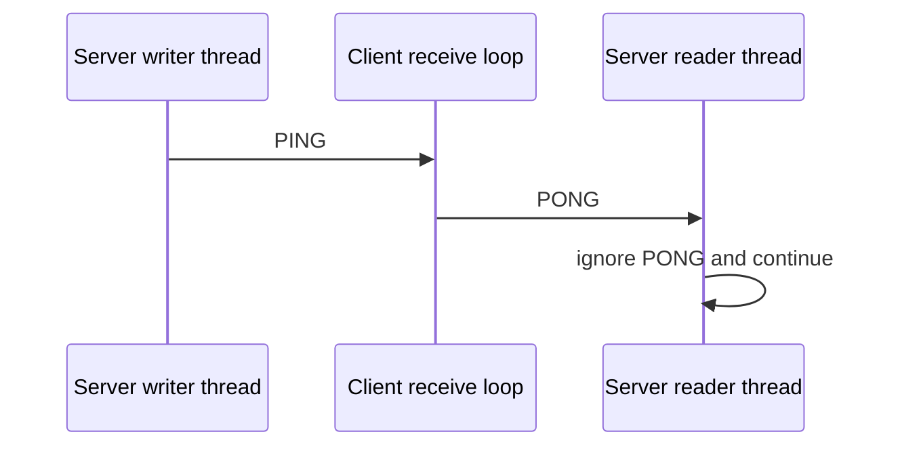
```mermaid
sequenceDiagram
    participant ServerWriter as Server writer thread
    participant Client as Client receive loop
    participant ServerReader as Server reader thread

    ServerWriter->>Client: PING
    Client->>ServerReader: PONG
    ServerReader->>ServerReader: ignore PONG and continue
```

The server also sets a socket read timeout using `HEARTBEAT_TIMEOUT_MILLIS`. If the timeout fires, the connection is closed.

---

## 18. Fault-tolerance model

The server keeps session state separate from socket state.

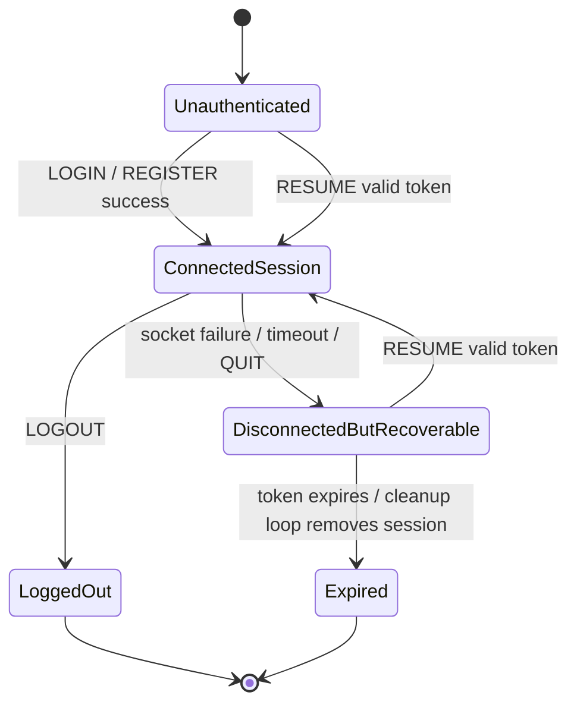
```mermaid
stateDiagram-v2
    [*] --> Unauthenticated
    Unauthenticated --> ConnectedSession: LOGIN / REGISTER success
    Unauthenticated --> ConnectedSession: RESUME valid token
    ConnectedSession --> DisconnectedButRecoverable: socket failure / timeout / QUIT
    DisconnectedButRecoverable --> ConnectedSession: RESUME valid token
    ConnectedSession --> LoggedOut: LOGOUT
    DisconnectedButRecoverable --> Expired: token expires / cleanup loop removes session
    LoggedOut --> [*]
    Expired --> [*]
```

Important behavior:

```text
Unexpected broken connection:
    session remains in SessionManager
    current room remains in ClientSession
    client can RESUME using token

LOGOUT:
    token is invalidated
    session is removed
    user leaves room
    connection closes

QUIT:
    connection closes
    token is not intentionally invalidated
```

This supports the design goal that user state should not be lost after a broken TCP connection.

### Session cleanup loop

The project also has an actual cleanup thread. `ChatServer` starts it in its constructor:

```text
ChatServer constructor
    -> Thread.startVirtualThread(this::sessionCleanupLoop)
```

That virtual thread periodically sleeps and calls `SessionManager.cleanupExpiredSessions()`.

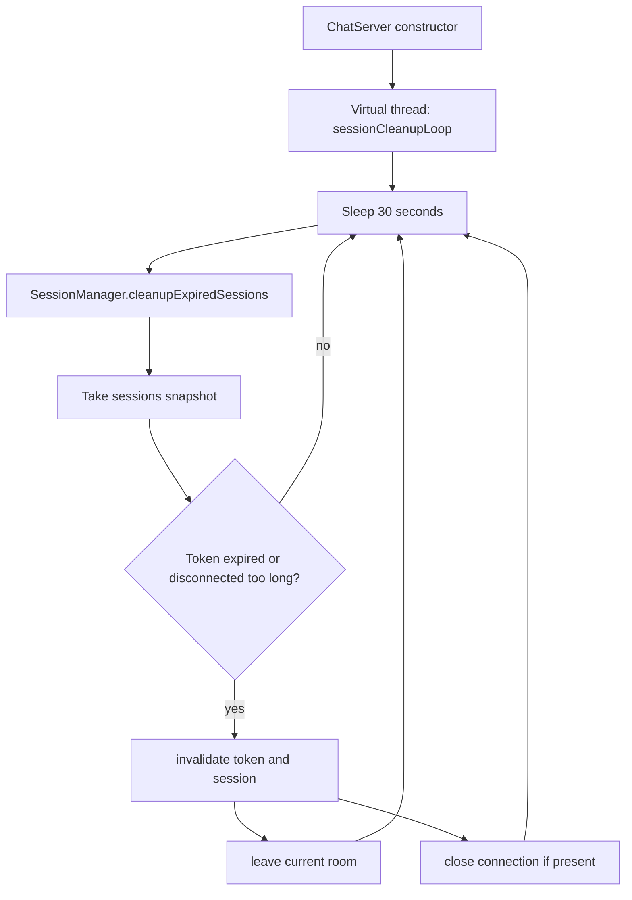
```mermaid
flowchart TD
    START[ChatServer constructor]
    START --> CLEAN[Virtual thread: sessionCleanupLoop]
    CLEAN --> SLEEP[Sleep 30 seconds]
    SLEEP --> CALL[SessionManager.cleanupExpiredSessions]
    CALL --> SNAP[Take sessions snapshot]
    SNAP --> CHECK{Token expired or disconnected too long?}
    CHECK -->|yes| INVALIDATE[invalidate token and session]
    INVALIDATE --> LEAVE[leave current room]
    INVALIDATE --> CLOSE[close connection if present]
    CHECK -->|no| SLEEP
    CLOSE --> SLEEP
    LEAVE --> SLEEP
```

`SessionManager.cleanupExpiredSessions()` checks two cases:

```text
1. tokenService.isExpired(session.tokenExpiresAt())
2. session is disconnected and disconnectedTimestamp is older than the allowed idle window
```

When either case is true, it calls `invalidate(session.token())`. Invalidation removes the token from `sessionsByToken`, leaves the current room, and closes the remaining connection if there is one. This prevents old disconnected users from staying in memory forever.

---

## 19. User persistence and password security

Users are persisted in `data/users.txt`.

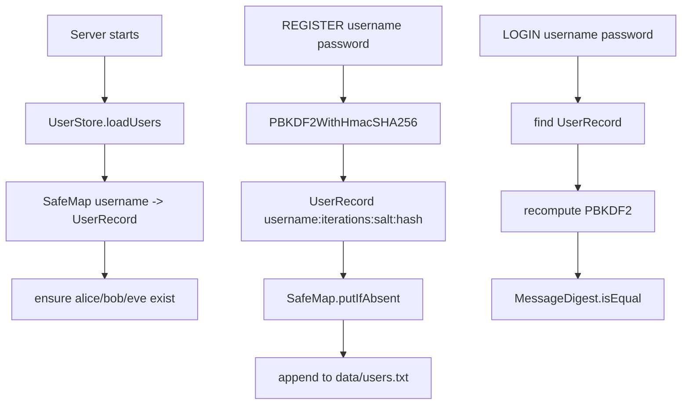
```mermaid
flowchart TD
    START[Server starts] --> LOAD[UserStore.loadUsers]
    LOAD --> MAP[SafeMap username -> UserRecord]
    MAP --> DEFAULTS[ensure alice/bob/eve exist]

    REGISTER[REGISTER username password] --> PBKDF2[PBKDF2WithHmacSHA256]
    PBKDF2 --> RECORD[UserRecord username:iterations:salt:hash]
    RECORD --> PUT[SafeMap.putIfAbsent]
    PUT --> FILE[append to data/users.txt]

    LOGIN[LOGIN username password] --> FIND[find UserRecord]
    FIND --> VERIFY[recompute PBKDF2]
    VERIFY --> EQUALS[MessageDigest.isEqual]
```

The project stores:

```text
username:iterations:salt:password_hash
```

It does not store plaintext passwords.

---

## 20. End-to-end program flow

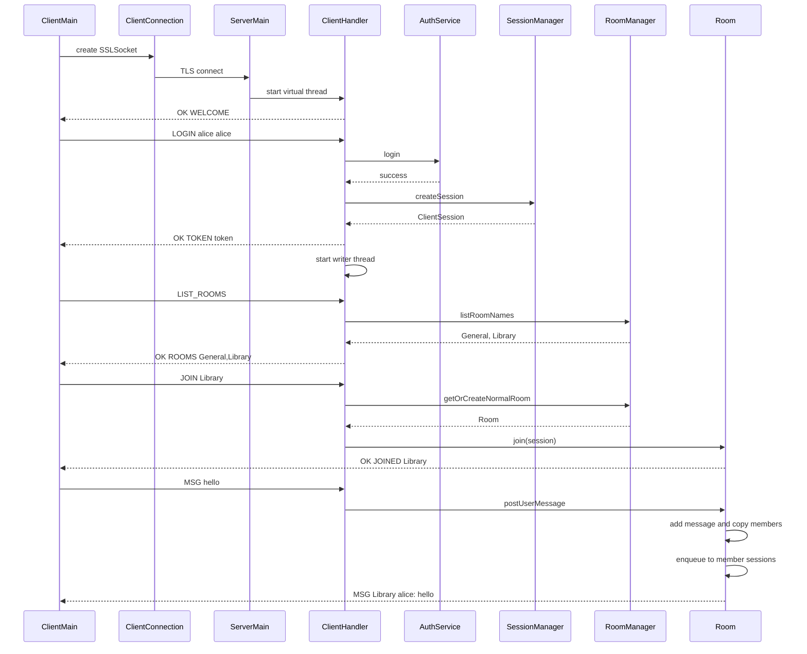
```mermaid
sequenceDiagram
    participant C as ClientMain
    participant CC as ClientConnection
    participant SM as ServerMain
    participant H as ClientHandler
    participant Auth as AuthService
    participant Sess as SessionManager
    participant Rooms as RoomManager
    participant Room

    C->>CC: create SSLSocket
    CC->>SM: TLS connect
    SM->>H: start virtual thread
    H-->>C: OK WELCOME

    C->>H: LOGIN alice alice
    H->>Auth: login
    Auth-->>H: success
    H->>Sess: createSession
    Sess-->>H: ClientSession
    H-->>C: OK TOKEN token
    H->>H: start writer thread

    C->>H: LIST_ROOMS
    H->>Rooms: listRoomNames
    Rooms-->>H: General, Library
    H-->>C: OK ROOMS General,Library

    C->>H: JOIN Library
    H->>Rooms: getOrCreateNormalRoom
    Rooms-->>H: Room
    H->>Room: join(session)
    Room-->>C: OK JOINED Library

    C->>H: MSG hello
    H->>Room: postUserMessage
    Room->>Room: add message and copy members
    Room->>Room: enqueue to member sessions
    Room-->>C: MSG Library alice: hello
```

---

## 21. Distributed-computing aspects satisfied

| Distributed systems concern | Implementation |
|---|---|
| Multiple clients over network | Separate client processes connect to the server using TCP/TLS. |
| Secure channel | `SSLServerSocket` / `SSLSocket`, TLSv1.3, explicit cipher suites. |
| Authentication | `LOGIN`, `REGISTER`, `RESUME`, `AuthService`, `UserStore`. |
| Session continuity | `SessionManager` maps token to `ClientSession`. |
| Broken connection recovery | Client can reconnect and send `RESUME <token>`. |
| Disconnected-session cleanup | `ChatServer.sessionCleanupLoop` periodically removes expired disconnected sessions. |
| Failure detection | Socket read/write failures plus `PING` / `PONG` heartbeat. |
| Concurrency | Virtual threads for blocking I/O. |
| Shared-state safety | Explicit locks around maps, rooms, sessions, queues. |
| Slow-client protection | Per-session outbound queues isolate slow clients. |
| Room consistency | Room lock protects member set and message history. |
| AI as distributed component | `AIRoom` calls a local Ollama service through `OllamaClient` and posts responses as `Bot`. |

---

## 22. Scenario checks

The normal client stays focused on user-facing chat commands. Validation flows are placed outside the interactive client, under `src/test/java/chat/tests/ScenarioChecks.java` and `scripts/run-scenario.sh`.

```mermaid
flowchart LR
    SCRIPT[run-scenario.sh] --> SCENARIOS[ScenarioChecks]
    SCENARIOS --> RECONNECT[reconnect]
    SCENARIOS --> HEARTBEAT[heartbeat]
    SCENARIOS --> SLOW[slow-client]
    SCENARIOS --> CONCURRENT[concurrent]
    SCENARIOS --> INVALID[invalid-token]

    RECONNECT --> RESUME[validates RESUME token recovery]
    HEARTBEAT --> PING[validates PING / PONG timeout]
    SLOW --> QUEUE[validates slow-client isolation]
    CONCURRENT --> LOCKS[validates lock-protected shared state]
    INVALID --> ERR[validates invalid token rejection]
```

These checks are not normal chat commands. They are practical validation flows that exercise the system’s key distributed and fault-tolerance behavior.

---

## 23. Current limitations and possible improvements

The current architecture meets its main design goals, but these improvements could strengthen it further:

1. Configure the Ollama endpoint/model from a file or command-line option instead of keeping only the default local endpoint.
2. Add sequence numbers to room messages for precise missed-message replay after reconnect.
3. Improve client UI so prompts and incoming messages do not visually collide.
4. Expand automated integration tests around reconnect, heartbeat timeout, slow clients, concurrent sends, and AI-room failures.
5. Add optional message-history persistence if long-term room history is required.

---

## 24. One-paragraph summary

The system is organized around a secure TLS server that accepts each client connection in a virtual thread. After authentication, a persistent `ClientSession` represents the user independently from the socket. Each session has a current room and an outbound queue. Room broadcasts add messages to room history, copy the current member list under a lock, and enqueue the formatted message to each member session. Per-session writer threads drain those queues and write to client sockets, preventing slow clients from blocking the room. Authentication uses persisted PBKDF2 password records, session resume uses secure random tokens, and TLS protects credentials, tokens, and messages in transit. Broken connections mark sessions disconnected/recoverable, and a cleanup virtual thread removes expired disconnected sessions. Shared data is protected using explicit locks rather than concurrent collection implementations.
